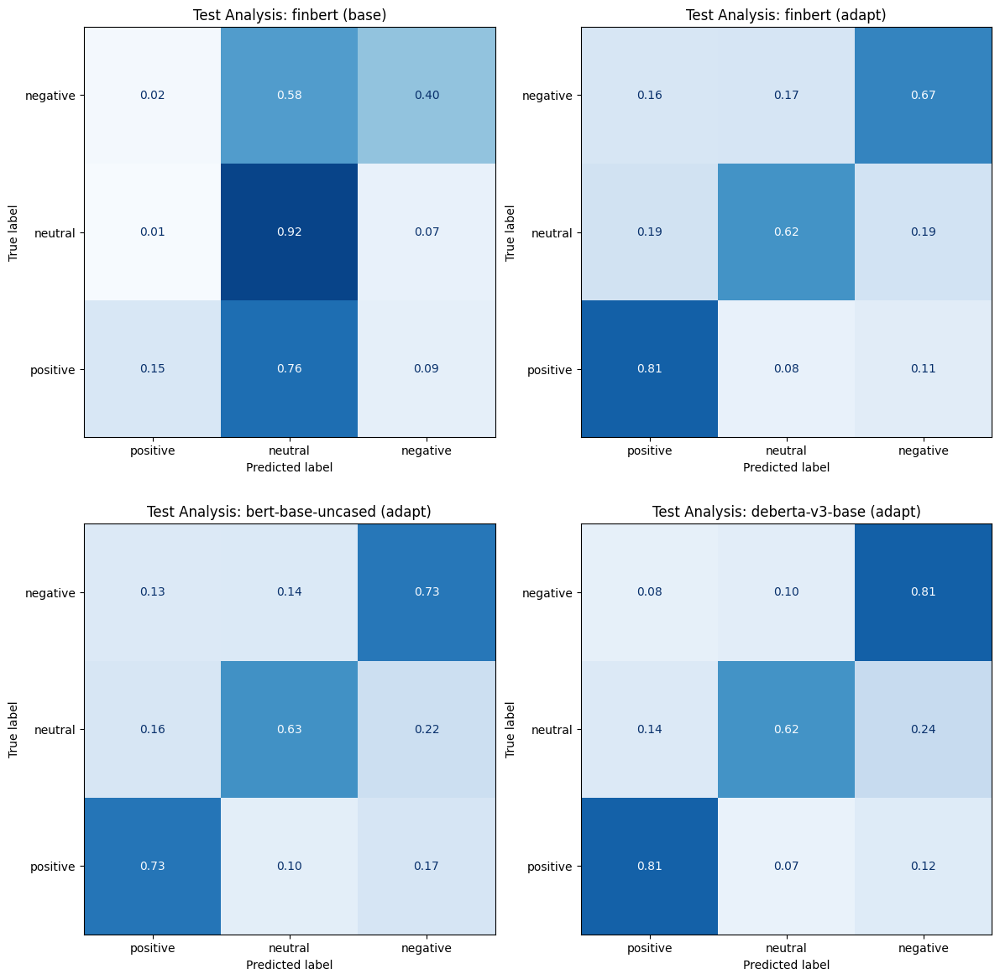
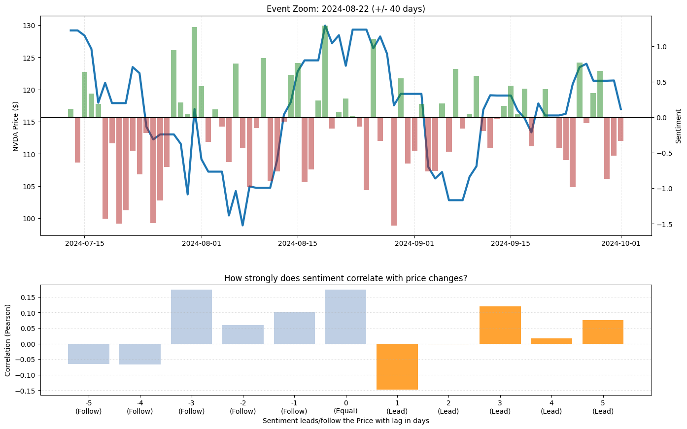

# NLP & Finance: Can r/wallstreetbets Predict Stock Movements? 🚀

> **Final Project for CS406: Natural Language Processing and the Web** > *University of Hamburg, January 2026*

This repository contains the implementation and analysis for a financial sentiment analysis system tailored to the informal slang of the subreddit r/wallstreetbets (WSB). Instead of relying on off-the-shelf financial models, this project utilizes **Domain Adaptation** to fine-tune Transformer models (DeBERTa v3) and performs a **Lead-Lag Analysis** to determine if retail sentiment drives the price of Nvidia ($NVDA) or merely reacts to it.

📄 **[Read the Full Project Report (PDF)](./pdf/CS_406_NLP_Final_Project_Report.pdf)** 💻 **[View the Notebook](./nlp_and_finance.ipynb)**


## Key Findings at a Glance

Does WSB sentiment predict the stock price? **No, it reacts to it.**


*Figure: Lead-Lag Correlation Analysis. Strong correlations at zero and negative lags indicate that sentiment follows price movements. The lack of correlation at positive lags suggests no predictive power for future returns on Large-Cap stocks like Nvidia.*


## Motivation

Traditional Financial Sentiment Analysis (FSA) relies on models like **FinBERT**, which are pre-trained on formal financial news (Reuters, Bloomberg). However, retail investors on Reddit communicate differently:

* **Slang:** *"YOLO"*, *"Diamond Hands"*, *"Tendies"*
* **Context:** *"Buy the dip"* (positive) vs. *"The dip keeps dipping"* (negative).
* **Irony:** High usage of sarcasm that confuses standard models.

**The Goal:** Build an end-to-end pipeline that (1) adapts to this domain language and (2) backtests the signal against 3 years of historical stock data.


## Methodology & Architecture

The system follows a four-stage pipeline:

1. **Data Ingestion:** Merging Reddit data ([Kaggle WSB 2022-2025](https://www.kaggle.com/datasets/gpreda/wallstreetbets-2022/versions/821)) with financial market data ([Yahoo Finance](https://github.com/ranaroussi/yfinance))
2. **Domain Adaptation:** Fine-tuning [`microsoft/deberta-v3-base`](https://huggingface.co/microsoft/deberta-v3-base) on a [Gold-Standard WSB dataset](https://arxiv.org/abs/2505.07871) to learn the slang
3. **Weighted Aggregation:** Calculating daily sentiment scores based not just on count, but weighted by **Upvotes** and **Comments** (Social Resonance)
4. **Time-Series Analysis:** Computing [Pearson correlation](https://pandas.pydata.org/docs/reference/api/pandas.DataFrame.corr.html) across time lags (-5 to +5 days)

### Sentiment Aggregation Formula

We define the daily sentiment signal $S_t$ by weighting the model's probability outputs ($P$) with the log-normalized user engagement ($w_i$):

$$S_t=\sum_i w_i \cdot \left(P_{\text{pos}} - P_{\text{neg}}\right) \cdot \ln \left(1 + N_{\text{eff}}\right)$$


## Results

### 1. Domain Adaptation Success

We compared a standard [`FinBERT`](https://arxiv.org/abs/1908.10063) against our domain-adapted [`DeBERTa-v3`](https://arxiv.org/abs/2111.09543). The standard model failed to detect WSB sentiment, classifying most posts as neutral. The adapted model significantly improved recall for positive/negative classes.


*Figure: Comparison of Confusion Matrices. Top Left: FinBERT Base (blind to slang). Bottom Right: DeBERTa Adapt (correctly classifies sentiment).*

### 2. Event Study: The August 2024 Volatility

During the earnings volatility in August 2024, the sentiment signal closely mirrored the price action with high precision.


*Figure: Overlay of Normalized Sentiment (Bars) and NVDA Price (Line). Note the "Inverse Indicator" behavior at extreme positive sentiment peaks.*

---

## Repository Structure

```bash
.
├── nlp_and_finance.ipynb     # Jupyter NB (Training, Inference, Backtesting)
├── CS_4...Project_Report.pdf # Final Scientific Report
└── README.md                 # This Project documentation

```

## Reproducibility

To reproduce the experiments:

1. Clone the repository
2. Install dependencies: (Mainly `transformers`, `torch`, `yfinance`, `pandas`)
3. Run the notebook `nlp_and_finance.ipynb`.
* *Note: Training the models requires a GPU. The inference/backtesting part can run on CPU using the cached results or pre-trained weights.*


## Credits

**Author:** Sven Juhnke

**University:** Universität Hamburg

**Course:** Natural Language Processing and the Web (Winter Term 2025/26)

---

### Citation

If you find this approach useful, please cite the project report:

```bibtex
@article{juhnke2026wsb,
  title={NLP and Finance: Can Financial Sentiment on r/wallstreetbets Lead Stock Movements?},
  author={Juhnke, Sven},
  journal={Final Project Report, CS406 NLP},
  year={2026},
  publisher={University of Hamburg}
}

```